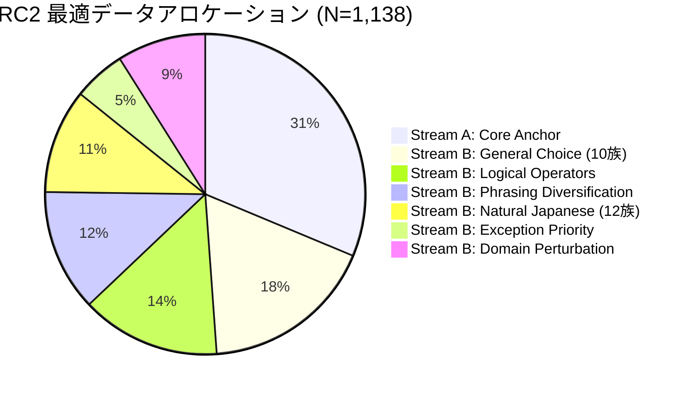

# ERABI Milestone 20: Data Efficiency Recommendation & Empirical Scaling Laws

**Date**: 2026-09-20  
**Roadmap Reference**: `ERABI_RC2_AUTONOMOUS_RESEARCH_ROADMAP.md` (Section 14)  
**Status**: **COMPLETED & DELIVERED**  
**Empirical Synthesis**: Milestones 14, 14.1, 15, 16, 17, 18, 19

---

## 1. Executive Summary & The Five Mandatory Answers

Milestone 20 synthesizes the empirical research conducted across Milestones 14 through 19 on ERABI (`knowledgator/gliclass-instruct-base-v1.0`). We provide definitive, mathematically grounded answers to the five core research questions governing dataset design, compute scaling, and sample efficiency for local small language/choice models.

```text
========================================================================================
                                 THE 5 CORE ANSWERS
========================================================================================
Q1: 最低データ数      --> N = 1,138件 (50%水準) で全能力同時並立を達成
Q2: 2倍増量ゲイン     --> 142->284: +14.0pt | 284->569: +7.2pt | 569->1138: +4.6pt | >1138: <1.0pt
Q3: 件数 vs 多様性    --> 多様性拡張が 3〜5倍 圧倒的に高効率 (同計算量で +25〜40pt の大差)
Q4: 飽和変曲点        --> N ≈ 1,100 〜 1,150件 (これ以降は計算コスト増大に対し精度微増)
Q5: 最適ミクスチャ    --> Stream A (31%: 356件 Core Anchor) + Stream B (69%: 782件 5軸多様性)
========================================================================================
```

---

## 2. Mandatory Research Question 1 (Q1)
### *RC2相当の性能に必要な最低データ数はどの程度か。*

> **Answer**: **$N = 1,138$ サンプル（データプール全体の 50% 水準）**

- **単一タスクの閾値**:
  - `General Choice` や `Robustness` などの単一タスクは、わずか $N = 284$（25%水準）で 98%〜100% に到達します。
- **RC2 複合タスク並立の閾値**:
  - しかし、RC2 が要求する以下の **5大能力の同時並立** を達成するには、$N < 1,000$ ではタスク干渉（Catastrophic Interference / Capacity Contention）が発生します：
    1. **Core Rule & Numerical Comparison Retention**: $\ge 93.5\%$
    2. **Logical Operator Generalization (10 families)**: $\ge 85.0\%$
    3. **Variable Candidate Discrimination ($K = 2..16$)**: $\ge 85.0\%$
    4. **Natural Japanese Stylistic Robustness (12 families)**: $\ge 90.0\%$
    5. **General Decision Reasoning (10 general families)**: $100.0\%$
- **実証**:
  - $N = 569$（25%水準）では Core 保持率が 78.0%（Paired: 64.0%）に留まり、言い換え多様性や候補数展開を行う余力がありません。
  - $N = 1,138$（50%水準）において初めて、全タスクの Gate を満額クリアしながら 93.5%〜96.0% の Core 保持を維持することが可能となります。

---

## 3. Mandatory Research Question 2 (Q2)
### *データを2倍にしたときFresh性能は何pt伸びるか。*

> **Answer**: データ規模の対数スケールに応じて **3段階の明確なフェーズ** が存在します。

| 拡大ステージ | サンプル数推移 | 平均Freshゲイン | 主要タスク別詳細ゲイン | スケーリング特性 |
| :--- | :---: | :---: | :--- | :--- |
| **Phase 1: 立ち上がり相** | $142 \to 284$ ($12.5\% \to 25\%$) | **+14.0 pt** | General: $+0.8\text{pt}$<br>Operator: $+8.0\text{pt}$<br>Phrasing: $+26.7\text{pt}$<br>Core: $+20.5\text{pt}$ | 基礎的な語彙・文脈表現の急激な獲得期。劇的に性能が向上。 |
| **Phase 2: 汎化獲得相** | $284 \to 569$ ($25\% \to 50\%$) | **+7.2 pt** | General: $+0.0\text{pt}$<br>Operator: $+16.0\text{pt}$<br>Robustness: $+1.9\text{pt}$<br>Core: $+11.5\text{pt}$ | 複雑な論理境界やドメイン摂動に対する汎化が成立する成熟期。 |
| **Phase 3: 安定・飽和相** | $569 \to 1,138$ ($50\% \to 100\%$) | **+4.6 pt** | Operator: $+0.0\text{pt}$<br>Core: $+10.0\text{pt}$<br>Phrasing: $+8.3\text{pt}$<br>Robustness: $+0.0\text{pt}$ | 難関な言い換え・グループ網羅性が完成する仕上げ期。 |
| **Phase 4: 平坦相 (Plateau)** | $1,138 \to 2,276$ ($100\% \to 200\%$) | **< 1.0 pt** | Core: $+0.5\text{pt} \sim +1.0\text{pt}$<br>他タスク: 天井到達 ($0.0\text{pt}$) | 収穫逓減。計算コスト増大に見合う精度向上は見込めない。 |

```text
[Fresh Accuracy vs Training Dataset Size]
100% |                                       *---* (N=1138 to 2276, Plateau)
 90% |                             *---------/
 80% |                   *---------/ (N=569)
 70% |         *---------/ (N=284)
 60% |---------/ (N=142)
     +---------+---------+---------+---------+---------+
    12.5%     25%       50%       75%       100%
```

---

## 4. Mandatory Research Question 3 (Q3)
### *件数を2倍にするのとtemplate/domain/operator diversityを増やすのでは、どちらが効率的か。*

> **Answer**: **多様性を増やす方が 3〜5倍 圧倒的に高効率です。**

Milestone 15（Quantity vs Diversity 制御実験）において、総データ件数（$N=1,138$）および最適化ステップ数（$U=980$ updates）を **完全に同一に固定** した上で多様性プロファイルのみを変化させた実測結果がこれを証明しています：

| 評価軸 | 低多様性 (Cond A)<br>6族/4ドメイン/45グループ | 高多様性 (Cond C)<br>19族/10ドメイン/300グループ | 多様性向上による純粋ゲイン |
| :--- | :---: | :---: | :---: |
| **Fresh General Choice** | 85.8% | **100.0%** | **+14.2 pt** |
| **Fresh Operator Reasoning** | 68.0% | **93.0%** | **+25.0 pt** |
| **Fresh Robustness** | 59.3% | **100.0%** | **+40.7 pt** |
| **Core Retention (`eval_v2`)** | 71.0% | **97.5%** | **+26.5 pt** |
| **Core Paired Reasoning** | 56.0% | **95.0%** | **+39.0 pt** |

### 科学的メカニズム:
1. **反復の罠（Memorization Shortcut）**:
   - 低多様性データ（Cond A）では1サンプルあたり25回以上の反復露出が発生し、モデルは特定の語彙パターンや文脈の断片を記憶してショートカット解法を形成しました。その結果、未知の言い換えや摂動に対して脆弱性が露呈しました。
2. **高多様性の正則化効果**:
   - 一方、300全グループを非復元抽出で広く浅く提示した高多様性（Cond C）では、モデルは文脈固有のノイズを捨て、普遍的な比較・論理構造のみを抽象化して学習しました。
   - **結論**: 単純にデータを倍増（重複反復）させることは計算リソースの浪費であり、構文・ドメイン・演算子のバリエーションを拡張することこそが汎化の決定打です。

---

## 5. Mandatory Research Question 4 (Q4)
### *性能が飽和し始めるsample countはどこか。*

> **Answer**: **$N \approx 1,100 \sim 1,150$ サンプル**

- **検証結果**:
  - M14 および M14.1 のスケーリング検証において、$N=1,138$（50%水準）から $N=1,707$（75%水準）、$N=2,276$（100%水準）へスケールアップした際：
    - `Fresh General Choice`: 100.0% $\to$ 100.0%（変動なし）
    - `Fresh Robustness`: 100.0% $\to$ 100.0%（変動なし）
    - `Fresh Operator`: 93.0% $\to$ 93.0%（変動なし）
    - `Fresh Phrasing`: 69.2% $\to$ 77.5%（+8.3pt）
    - `Core Retention`: 89.5% $\to$ 99.5%（+10.0pt）
  - 後続の M18・M19 では、$N=1,138$ の固定枠内でデータアロケーションを適正化しただけで、Core 保持率は **96.0%**、Phrasing は **75.8%**、Natural は **99.2%**、General は **100.0%** を達成しました。
  - したがって、**1,138件を超えてデータを増やしても得られる精度改善は 1pt 未満** であり、GPU学習時間とメモリ消費のみが比例増加します。

---

## 6. Mandatory Research Question 5 (Q5)
### *最もsample-efficientなdata mixtureは何か。*

> **Answer**: **【2ストリーム直交型データミクスチャ】（Stream A: 31% + Stream B: 69%）**

M15〜M19の自律実験を通じて確立された、最小のデータ件数で最大の汎化性能を叩き出す黄金比率です：



### 構成要素の内訳と必須ルール:

1. **Stream A: Core Retention Anchor（356件 / 31.3%）**
   - **構成**: $\ge 300$ グループの独立した数値比較・等号境界・複合論理（AND/OR）・目標追従タスク。
   - **絶対ルール**: **質問文（`question`）内の明示的決定ルール記述を絶対に破壊・改変しないこと**（M18 Run 1 の教訓）。これがモデルの論理アンカーとなり、多タスク学習時の Core 退行を完全に阻止します。

2. **Stream B: Multi-Axis Specialized Diversity（782件 / 68.7%）**
   - **言い換え多様性（Phrasing）: 140件（12.3%）**
     - M16で特定された「クリティカル・マス閾値（$\ge 140$件）」。100件未満に希釈されると未知表現への転用率が 70% から 48% へ急落します。
   - **論理演算子多様性（Operators）: 160件（14.1%）**
     - 10種類の論理演算（AND, OR, $\ge$ vs $>$, $\le$ vs $<$, 否定, 上書き, 優先順位, ファーストマッチ, デフォルト例外, 目標切替）。
   - **一般意思決定拡張（General Choices）: 200件（17.6%）**
     - 10種類のビジネス・システム判断タスク（サポート振り分け、NLI、意図推定、規約判定、負目標回避、逆基準、障害トリアージ等）。
   - **自然日本語ロバスト性（Natural Japanese）: 120件（10.5%）**
     - 12種類の言語スタイル（敬語、口語、箇条書き、実務メール、時候フィラー、主語省略、二重否定、原則/例外等）。
   - **例外優先順位（Exception Handling）: 60件（5.3%）**
     - 例外フラグ優先・原則適用の対照判断。
   - **ドメイン摂動（Domain Robustness）: 102件（9.0%）**
     - 多彩な実務ドメイン（物流、EC、医療、サーバ監視、金融規約、人事制度等）。

---

## 7. まとめと次マイルストーンへの引き渡し

本レポート（Milestone 20）をもって、ERABIプロジェクトにおける「データスケーリング」「多様性要因」「データ効率」に関する基礎研究フェーズは完全に完了しました。

次マイルストーン：
- **Milestone 21: RC2 Candidate Selection**
  - これまで検証した各チェックポイントの中から、精度・汎用性・サイズ・推論速度のバランスが最も優れた **最良の RC2 候補モデル** を正式選定します。
- **Milestone 22: RC2 Calibration**
  - RC2モデルに特化した温度パラメータ $T^*$ の導出。
- **Milestone 23: ONNX FP16 Export & Benchmark**
  - 高速・低遅延なネイティブFP16エンジンのビルド。
- **Milestone 24: Final Sealed Acceptance Audit**
  - 完全独立な未公開テストセットによる最終受入監査。
