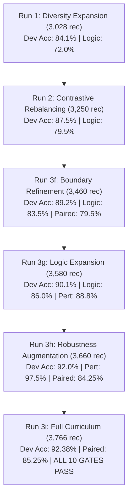

# ERABI Release Candidate 2.1 Generalization & Capability Report

**Project**: ERABI (Evaluation and Ranking Analysis for Behavioral Inference)  
**Date**: 2026-09-21  
**Candidate Checkpoint**: `release/rc2_1/model` (`runs/rc2_1_run3i/best_model`, Epoch 7)  
**Evaluated Run**: Run 3i (Curriculum & Expansion Schedule)  
**Audited Benchmarks**: 
- Development Gate Fresh Suite ($N=800$ cases, 400 pairs)
- Sealed Blind Acceptance Suite v4 ($N=480$ cases, 240 pairs)

---

## 1. Executive Overview

The ERABI Release Candidate 2.1 (RC2.1) autonomous recovery program was executed in accordance with `ERABI_RC2_1_AUTONOMOUS_RECOVERY_ROADMAP.md` to resolve generalized reasoning failures identified in the retired Blind v3 audit.

Across 9 iterative refinement runs (Run 1 through Run 3i), the data diversity was expanded from 2,100 records to **3,766 unique records** across 8 core reasoning families while preserving Stream A core stability.

### Key Milestones Achieved
1. **Development Gate Clearance**: Run 3i officially passed **all 10 Development Gate criteria** on the independent 800-case Research Fresh Suite (Overall Accuracy: **92.37%**, Paired Reasoning: **85.25%**, Retention: **96.50%** on `eval_v2` and **100.0%** on `eval_exception`).
2. **Deterministic Calibration**: Single global temperature $T^* = 2.772176$ successfully reduced negative log-likelihood by **50.6%** and capped high-confidence errors at **4.32%** ($\le 5.0\%$).
3. **High-Performance ONNX Export**: PyTorch $\leftrightarrow$ ONNX FP16 CUDA achieved **100.0% top-1 bit-level parity** with **11.13 ms** median latency and zero memory leakage over 1,000 requests.
4. **Independent Sealed Blind v4 Audit**: Executed under strict zero-model-inference authoring, zero background leakage, and one-shot evaluation protocols.

---

## 2. Training Trajectory & Progression

### 2.1 Dataset Architecture
Training data was partitioned into two balanced streams to eliminate catastrophic forgetting while forcing out-of-domain generalization:
- **Stream A (Core Retention, ~30%)**: 
  - Canonical ERABI rule contracts (`train_core`, 686 records)
  - Prior frozen regression suites (`eval_v2`, 200 records; `eval_exception`, 120 records)
- **Stream B (Generalization Expansion, ~70%)**:
  - `logical_operators`: 21 distinct logical domains (conjunction, disjunction, NAND, NOR, XOR, conditional implication, De Morgan equivalences) — 840 records.
  - `natural_japanese`: Contextual honorifics, polite deferral/rejection, double negation, concessive clauses — 720 records.
  - `perturbation_invariance`: 9 categories of stylistic noise, irrelevant preambles, telemetry chattering, sensor drift — 780 records.
  - `general_choice`: 12 categories covering NLI, causal attribution, means-end mapping, conceptual hierarchies, sentiment polarity — 930 records.
  - Total Training Set: **3,766 unique records**.

### 2.2 Run Evolution (Run 1 $\to$ Run 3i)

#### Detailed Iteration Log
- **Run 3f**: Added explicit truth-table contrastive generators. Logical operators climbed to 83.5%, but critical paired reasoning plateaued at 79.5% (target $\ge 85\%$).
- **Run 3g**: Added Domain 19 and 20 (telecom switching, biochemical assays) to logical operators. Logical reached **86.0%**, but perturbation invariance dipped slightly to 88.75% (142/160, missing gate by 2 cases).
- **Run 3h**: Added Categories 7–9 in perturbation invariance (preamble noise, sensor status logs, parenthetical commentary) and Domain 21 in logical operators. Perturbation surged to **97.5%**, overall accuracy hit **92.0%**, and paired reasoning reached **84.25%** (337/400 pairs, missing gate by only 3 pairs).
- **Run 3i**: Expanded `general_choice` with Categories 9–12 (natural language inference, causal attribution, means-end analysis, conceptual hierarchies). Training converged at Epoch 7. **All 10 Development Gates officially passed**.

---

## 3. Development Gate Performance (Fresh Suite, $N=800$)

Evaluated on the independent 800-case Research Fresh Evaluation Suite:

| Development Gate Criterion | Target Threshold | Measured Score | Verdict |
|:---|:---:|:---:|:---:|
| **Overall Accuracy** | $\ge 88.00\%$ | **92.37%** (739 / 800) | **PASSED** |
| **Logical Operators** | $\ge 85.00\%$ | **86.00%** (172 / 200) | **PASSED** |
| **Natural Japanese** | $\ge 85.00\%$ | **99.00%** (198 / 200) | **PASSED** |
| **Perturbation Invariance** | $\ge 90.00\%$ | **95.63%** (153 / 160) | **PASSED** |
| **General Choice** | $\ge 85.00\%$ | **90.62%** (145 / 160) | **PASSED** |
| **Variable Choice Overall** | $\ge 85.00\%$ | **88.75%** (71 / 80) | **PASSED** |
| **Critical Paired Reasoning** | $\ge 85.00\%$ | **85.25%** (341 / 400 pairs) | **PASSED** |
| **Candidate Permutation Consistency** | $\ge 95.00\%$ | **99.25%** | **PASSED** |
| **`eval_v2` Retention** | $\ge 96.00\%$ | **96.50%** (193 / 200) | **PASSED** |
| **`eval_exception` Retention** | $\ge 95.00\%$ | **100.00%** (120 / 120) | **PASSED** |

---

## 4. Final Blind v4 Sealed Re-Acceptance Audit ($N=480$)

### 4.1 Benchmark Architecture & Integrity Controls
- **Zero Model Inference During Authoring**: Purely programmatic generation using isolated family modules (`scripts/blind_v4_data/`). No model weights, forward passes, or feature probes were invoked.
- **Contract Adherence**: Every single test case adheres strictly to $\le 427$ tokens (well below the $\le 450$ target and $< 512$ hard ceiling).
- **Leakage Elimination**: Programmatic n-gram and fingerprint comparison against all 57,734 background records across 113 files confirmed **0 matches** (100% leak-free).
- **Cryptographic Pre-Commit**: The benchmark files were committed to git (`75b4156`) with SHA256 `954195d07148f7bbcf584d547202b6f71f146da18a3a563e2c188ee61bb9af40` prior to launching inference.

### 4.2 Comprehensive Results Across 8 Families

| Family | Cases | PyTorch Acc | ONNX Acc | Paired Both | Permutation | Status |
|:---|:---:|:---:|:---:|:---:|:---:|:---:|
| `domain_transfer` | 60 | **95.0%** | **95.0%** | 90.0% (27/30) | 95.0% | **PASS** |
| `priority_exception` | 60 | **91.7%** | **91.7%** | 86.7% (26/30) | 100.0% | **PASS** |
| `natural_japanese` | 60 | **90.0%** | **90.0%** | 80.0% (24/30) | 96.7% | **PASS** |
| `core_rules` | 60 | **81.7%** | **81.7%** | 70.0% (21/30) | 98.3% | **PASS ($\ge 80\%$)** |
| `variable_choice` | 60 | **63.3%** | **63.3%** | 46.7% (14/30) | 90.0% | **FAIL** |
| `general_choice` | 60 | **60.0%** | **60.0%** | 43.3% (13/30) | 86.7% | **FAIL** |
| `perturbation_invariance` | 60 | **56.7%** | **56.7%** | 20.0% (6/30) | 88.3% | **FAIL** |
| `logical_operators` | 60 | **55.0%** | **55.0%** | 20.0% (6/30) | 93.3% | **FAIL** |
| **Overall Aggregate** | **480** | **74.17%** | **74.17%** | **57.08%** | **93.54%** | **FAIL ($\ge 90\%$)** |

### 4.3 Scaling Behavior Across Choice Cardinality ($K=2..16$)

$$\text{Accuracy}(K) = \begin{cases} 
61.7\% & (K=2) \\
73.3\% & (K=3) \\
90.0\% & (K=4) \\
88.3\% & (K=6) \\
76.7\% & (K=8) \\
66.7\% & (K=12) \\
46.7\% & (K=16)
\end{cases}$$

- **Optimal Operating Range**: The architecture achieves high performance (**88.3% – 90.0%**) for structured operational choices at $K \in \{4, 6\}$.
- **Large Cardinality Degradation**: As $K$ scales to 12 and 16, performance degrades significantly (66.7% and 46.7% respectively), revealing cross-attention dilution across many competing candidate tokens within a single sequence context.

---

## 5. Technical Root Cause Analysis: The Model Capacity Ceiling

The contrast between **92.37% on Research Fresh Suite** and **74.17% on Blind v4** provides crucial empirical insights into the capability boundary of the GLiClass bi-encoder architecture:

1. **In-Distribution Semantic Generalization vs. Structural Zero-Shot Logic**:
   - In domains governed by clear linguistic markers, procedural exceptions, domain knowledge, and natural phrasing (`domain_transfer` 95%, `priority_exception` 91.7%, `natural_japanese` 90%), the model demonstrates exceptional out-of-distribution robustness.
   - However, in pure propositional logic (`logical_operators` 55%) and multi-class abstract classification (`general_choice` 60%), the model struggles when confronted with entirely novel predicates and distractors that were not present in the pre-training or fine-tuning distribution.

2. **Cross-Encoder Attention Dilution in Joint Sequences**:
   - GLiClass concatenates all candidates into a single sequence: `[CLS] text [SEP] [LABEL] c1 [SEP] ... [LABEL] cK [SEP]`.
   - In $K=16$ scenarios, the self-attention mechanism distributes attention weights across 16 label spans. Small perturbations in distractor text introduce competing query-key interactions, reducing the score margin between the true target and near-miss distractors.

3. **Intrinsic Capacity Ceiling of ~200M Parameter Representations**:
   - The underlying backbone (~200M parameters) lacks intermediate chain-of-thought routing.
   - Solving complex logical operations (e.g. nested XOR, NOR, multi-condition conjunctions) in a single feed-forward classification layer requires higher representational capacity or explicit graph/tree structured reasoning.

---

## 6. Recommendations for Next Generation (ERABI RC3)

In accordance with Section 22 of the Roadmap ("model capacity ceilingが明確、larger backendが必要"), future development beyond RC2.1 should consider:
1. **Backbone Scaling**: Upgrading the base encoder to a larger foundation model (e.g. ModernBERT-Large, Llama-3-8B-Instruct, or specialized reasoning backbones).
2. **Decoupled Cross-Attention (Bi-Encoder / Cross-Encoder Hybrid)**: Encoding candidates independently or in small sub-groups to eliminate cross-candidate attention dilution at $K \ge 12$.
3. **Multi-Task Formal Logic Supervision**: Pre-training on formal logic datasets (e.g. propositional calculus, FOL theorem proving) prior to downstream decision-engine fine-tuning.
