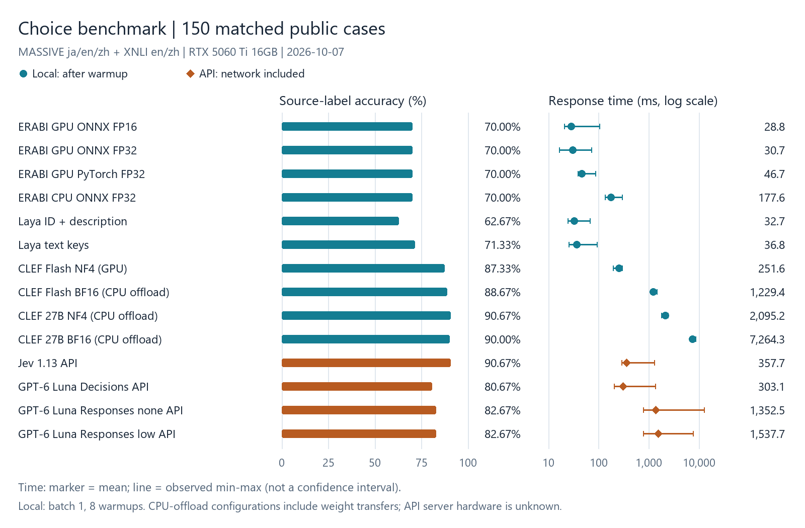
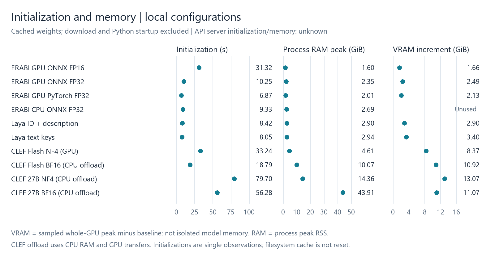

# ERABI（えらび）

Jevっぽい「状況を読んで候補を選ぶ」動きを、GLiClassを使って再現してみた実験プロジェクトです。Jevの公式版でも、内部実装の再現版でもありません。

状況 `context`、判断基準 `question`、2〜16個の `choices` を渡すと、全候補の確率分布をローカルで返します。会話のツール選択、ゲームNPCの行動、コマンドの危険性分類などを試すための判断エンジンで、文章や画像を生成したり、選んだツールを実行したりはしません。

GLiClassの約438Mパラメータモデルを追加学習し、PyTorch safetensors・CPU用ONNX FP32・GPU用ONNX FP16を配布しています。入力全体の上限は512トークン。日本語・英語・中国語を含むデータで実験していますが、品質は用途ごとに検証が必要です。

[公開モデル](https://huggingface.co/sugarknight/erabi-practical-v1-experimental) · [詳しい使い方](docs/USAGE.md) · [ベンチマーク詳細](docs/BENCHMARKS.md) · [追加学習とデータ形式](docs/TRAINING.md)

## すぐに試す

Python 3.11以上が必要です。以下はWindows PowerShellの例です。

### 1. 仮想環境とインストール

```powershell
py -3.12 -m venv .venv
.\.venv\Scripts\Activate.ps1
python -m pip install --upgrade pip
$env:HF_HUB_DISABLE_SYMLINKS = "1"  # Windowsで管理者権限なしのキャッシュを使用

# CPU + ONNX FP32（おすすめ）
python -m pip install torch --index-url https://download.pytorch.org/whl/cpu
python -m pip install erabi onnxruntime
```

Linux/macOSは `python3 -m venv .venv` と `source .venv/bin/activate` に置き換えます。有効化できない場合、Windowsでは `.\.venv\Scripts\python.exe` を直接使えます。

NVIDIA GPUを使う場合は、別の仮想環境で、環境に合う[GPU用PyTorch](https://pytorch.org/get-started/locally/)を導入してから次を実行します。

```powershell
# 動作確認済みのCUDA 13構成（RTX 5060 Ti）
python -m pip install torch==2.12.0 --index-url https://download.pytorch.org/whl/cu130
python -m pip install erabi onnxruntime-gpu==1.30.0
```

CPU版 `onnxruntime` とGPU版 `onnxruntime-gpu` は同じ環境に両方入れないでください。GPUには互換なCUDA/cuDNNが必要です（[対応表](https://onnxruntime.ai/docs/execution-providers/CUDA-ExecutionProvider.html)）。ONNXを使わない場合は `pip install erabi` だけでPyTorch版を利用できます。

### 2. sample.pyを作る

以下を `sample.py` として保存してください。初期化と推論の時間を表示します。

```python
from time import perf_counter
from erabi.model_loader import load_engine
from erabi.schema import ChoiceRequest

print("モデルを読み込みます（初回はダウンロード）...", flush=True)
t = perf_counter()
engine = load_engine(device="cpu", revision="main")
print(f"初期化: {perf_counter() - t:.2f}秒 / {engine.model_format}")

request = ChoiceRequest.from_dict({
    "context": "ユーザーが今日の宮崎の天気を知りたいと言った。",
    "question": "次に使う機能を選んでください。",
    "choices": [
        {"id": "chat", "text": "雑談をする"},
        {"id": "web", "text": "Web検索する"},
        {"id": "image", "text": "イラストを作成する"},
    ],
})

print("推論します...", flush=True)
t = perf_counter()
result = engine.predict(request)
print(f"推論: {perf_counter() - t:.3f}秒")
print("選択:", result.best_candidate_id)
print("確率:", {c.id: round(c.probability, 4) for c in result.choices})
```

```powershell
python sample.py
```

GPUでは `device="cuda:0"` に変更します。モデルが未取得なら、必要な形式だけ自動ダウンロードします（約0.88〜1.76GB）。初期化時間には初回ダウンロードが含まれ、2回目以降はキャッシュを再利用します。

この例の `revision="main"` は最新の公開モデルを選ぶ指定です。PyPI版0.1.4の既定モデルは最新ではないため、この指定を付けてください。再現性が必要な場合は[モデルのコミットID](docs/BENCHMARKS.md#配布物の識別)を指定してください。

## モデル形式と保存先

| 利用環境 | おすすめ | 自動選択 |
|---|---|---|
| CPU + ONNX Runtime | ONNX FP32 | `onnx-fp32` |
| NVIDIA GPU + CUDA対応ONNX Runtime | ONNX FP16 | `onnx-fp16` |
| ONNX Runtimeなし・互換性優先 | PyTorch safetensors | `pytorch` |

```python
engine = load_engine(
    device="cpu", model_format="onnx-fp32",
    revision="main", cache_dir="./model-cache",
)
```

保存先は `ERABI_MODEL_CACHE_DIR` 環境変数でも指定できます。形式の明示指定、バッチ処理、CLI、ローカルHTTP APIは[使い方](docs/USAGE.md)を参照してください。

GPUの自動選択は容量を抑えたFP16です。ただし機種・入力によってはFP32の方が速い場合があります。GPUでFP32を試すには `load_engine(device="cuda:0", model_format="onnx-fp32", revision="main")` を指定します。

## ベンチマーク

### 共通150問の比較

ERABI・Laya・CLEF・CLEF Flash・Jev・GPT-6 Lunaを、同じ公開150問で比較した結果です（2026-10-07）。MASSIVEの日英中の意図分類96問と、XNLIの英中の文間関係54問が対象です。正答率は公開元ラベルとの一致率で、公式ベンチマークscoreや用途全般の性能保証ではありません。



この150問では、平均時間はERABI GPU ONNX FP16の28.80msが最短、正答数はJevとCLEF NF4の136/150（90.67%）が最多です。数問の差から一般的な優劣は断定できません。Layaは候補ID＋説明文と文章キーの2形式を分けています。

### 初期化・メモリ・費用



<details>
<summary>全14構成の数値表：正答率・初期化・平均/最短/最長・RAM/VRAM・費用</summary>

| モデル・構成 | 正答率 | 初期化（秒） | 平均/件（ms） | 最短〜最長（ms） | VRAM増分（GiB） | RAM peak（GiB） | API費用/150件（USD） |
|---|---:|---:|---:|---:|---:|---:|---:|
| ERABI GPU ONNX FP16 | 70.00% | 31.32 | 28.80 | 20.51〜102.64 | 1.66 | 1.60 | なし |
| ERABI GPU ONNX FP32 | 70.00% | 10.25 | 30.73 | 16.28〜72.07 | 2.49 | 2.35 | なし |
| ERABI GPU PyTorch FP32 | 70.00% | 6.87 | 46.66 | 38.16〜85.55 | 2.13 | 2.01 | なし |
| ERABI CPU ONNX FP32 | 70.00% | 9.33 | 177.62 | 134.51〜292.64 | 未使用 | 2.69 | なし |
| Laya ID＋説明文 | 62.67% | 8.42 | 32.73 | 24.49〜67.38 | 2.90 | 2.90 | なし |
| Laya 文章キー | 71.33% | 8.05 | 36.85 | 25.41〜92.98 | 3.40 | 2.94 | なし |
| CLEF Flash NF4・GPU常駐 | 87.33% | 33.24 | 251.60 | 191.06〜295.23 | 8.37 | 4.61 | なし |
| CLEF Flash BF16・CPU退避 | 88.67% | 18.79 | 1229.41 | 1076.16〜1429.19 | 10.92 | 10.07 | なし |
| CLEF 27B NF4・CPU退避 | 90.67% | 79.70 | 2095.20 | 1754.29〜2396.86 | 13.07 | 14.36 | なし |
| CLEF 27B BF16・CPU退避 | 90.00% | 56.28 | 7264.33 | 6524.45〜8506.48 | 11.07 | 43.91 | なし |
| Jev 1.13 API | 90.67% | 不明 | 357.71 | 285.81〜1266.42 | 不明 | 不明 | 0.00315609 |
| GPT-6 Luna Decisions | 80.67% | 不明 | 303.13 | 202.45〜1349.18 | 不明 | 不明 | 0.00343020 |
| GPT-6 Luna Responses none | 82.67% | 不明 | 1352.52 | 761.69〜12530.08 | 不明 | 不明 | 0.00536160 |
| GPT-6 Luna Responses low | 82.67% | 不明 | 1537.74 | 765.10〜7465.62 | 不明 | 不明 | 0.00837510 |

</details>

- 測定環境：RTX 5060 Ti 16GB、Ryzen 7 5800X、RAM 96GB。ローカルはbatch 1・8 warmups後、入力整形を含む推論時間です。APIは通信とサーバー処理を含む往復時間です。
- 初期化は保存済みweightsの読込・backend準備。Python起動・初回downloadは除外し、file cacheは消去していません。上のサンプルの初回初期化時間とは定義が異なります。
- VRAMは全GPUのsample peak−開始値で、モデル専有量ではありません。RAMはプロセスpeak RSS。APIサーバーの初期化・RAM/VRAMは不明です。
- CLEF 27Bの両形式とCLEF Flash BF16はCPU退避・GPUへのweights転送を併用し、専用の高速化kernelは未導入です。形式だけの速度比較や、大容量GPUでの性能を示すものではありません。
- API費用は測定時のusage×単価による推計です。ローカルの「なし」はAPI課金がないという意味で、電気代・機材費は未測定です。

入力は短文（ERABI tokenizerで61〜133 tokens）で、MASSIVEは16候補、XNLIは3候補です。独立した人手goldや事前学習との非重複は保証していません。長文・NPC・危険コマンドなどへ、この順位をそのまま適用しないでください。

[p50/p95・カテゴリ別成績・モデル版・集計と図の再現](docs/DECISION_ENGINE_COMPARISON.md) · [独自NPC/ゲーム制御/コマンド分類などの用途別評価](docs/BENCHMARKS.md)

## 制限と安全性

全候補のlogitsに一度だけSoftmaxを適用し、候補IDと入力順を保持します。入力上限は状況・質問・候補を整形した全体で512トークンです。超過入力は黙って切り詰めずエラーにします。

出力は確認対象（`review`）で、未校正です。高い確率は正解や安全の保証ではありません。危険コマンド判定も実行許可の代わりにはならず、パス・権限・許可リストなど別の制御が必要です。

## さらに詳しく

- [使い方](docs/USAGE.md)：バッチ処理、キャッシュ、形式選択、CLI、HTTP API
- [ベンチマーク](docs/BENCHMARKS.md)：比較条件、速度・メモリ、量子化・長文の知見
- [追加学習](docs/TRAINING.md)：JSONL形式、group分割、学習・モデル選択、再現方法
- [設計仕様](docs/ERABI_DESIGN.md)：実装の入力・数値契約

コードは[MIT](LICENSE)。モデルと依存には別のライセンスが適用されます（[第三者ライセンス](THIRD_PARTY_LICENSES.md)）。
